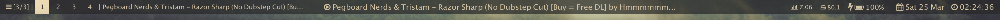
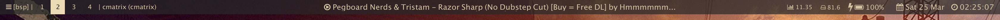
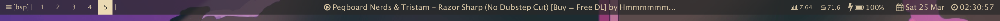
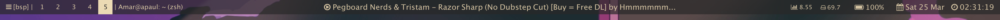

# zenbar

### maintenance
This is a side project of mine, so it may not have everything to suit your needs. Some other neat bars for macOS:
- https://github.com/apierz/chunkbar.widget
- https://github.com/blaadje/fancyBar
- https://github.com/zzzeyez/Pecan

### zenbar widget
* Works with both `kwm` and `chunkwm`
* Dynamically changing colors (based on wrapper script around pywal)
* Displays `bsp`/`float`/`[n/m]` (monocle mode)  
* List of spaces, with active one highlighted with color  
* Name of focused window
* Currently-playing song
* cpu/mem info 
* Battery percentage remaining (including whether it's charging)
* Date and time 

Space 1 or 2:



Difference between charging and not charging:



Dynamic Color Changing:  
This works by caching a `colors.json` file as `colors_<desktopID>.json` for each different desktop ([This script](https://github.com/Amar1729/dotfiles/blob/4c1b4219ff1c66cdff3b6dfa7eb6a0e3b067bb2f/.bin/unique_space.sh) can automatically do this as a wrapper for `pywal`). Each desktop has a saved file, and `theme.coffee` and `focused-window.coffee` load from it every 1s. 


### My Changes

* Changed the kwm/chunkwm active space information to a color box rather than parentheses (see screens)
* Added dynamic color loading/changing (for use with pywal, themer, etc)
* Added bolt symbol near battery to indicate when charging (font-awesome currently (Jan 2017) has no charging battery symbol) - see screenshots
* Changed font to monospace and increased the size in certain areas for important text
* Modified widget spacing

### Previous Work (as of 03/20/17)

* [Herrbischoff's original nerdbar](https://github.com/herrbischoff/nerdbar.widget), inspired by koekeishiya's NerdTool configuration
* [koekeishiya's modified nerdbar](https://github.com/koekeishiya/nerdbar.widget) (kwm/khd author)  
  * added `active-space` widget
  * added support for font-awesome icons
  * improved querying to kwmc
  * fixed now playing: `playing.coffee`, which uses Firefox plugin [CurrentSong](https://addons.mozilla.org/en-us/firefox/addon/currentsong/) to also display the currently-playing song in the bar  
* [deathbeam's modified nerdbar](https://github.com/deathbeam/dotfiles/tree/fac1bc6ec8ba4ca16ef31d92ce93c6f2a2681f8b/lib/macos/bar.widget), which made the following additions:  
  * modifed `focused-window` to include current/total spaces (very helpful)
  * ellipsis cutoff if focused-window title is too long

## Installation

Make sure you have [Übersicht](http://tracesof.net/uebersicht/) installed, and then clone this repository.  
IMPORTANT: Make sure you name the resulting folder `amar-bar.widget`, or change the image paths in `background.coffee` and `focused-window.coffee`, since they source css and scripts (respectively) starting with the parent directory's name.  
```bash
# or wherever your ubersicht looks for widgets (mine looks in ~/.config/ubersicht/widgets/)
git clone https://github.com/Amar1729/nerdbar.widget $HOME/Library/Application\ Support/Übersicht/widgets/amar-bar.widget
```
